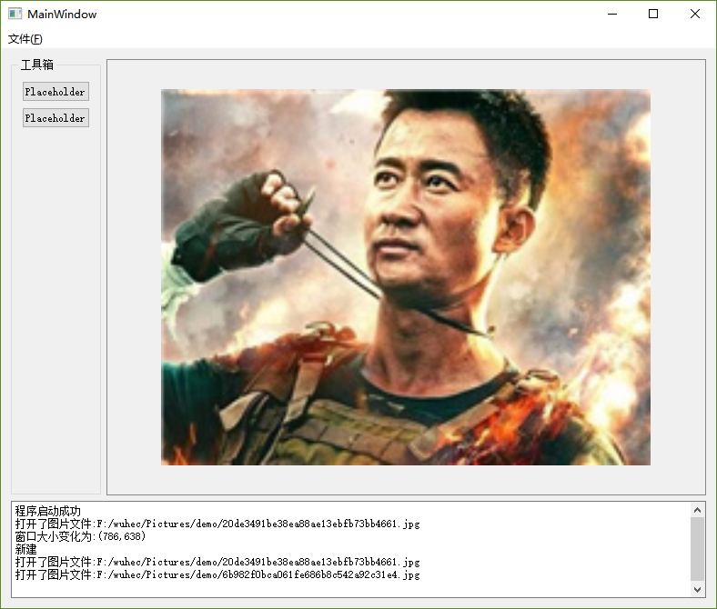
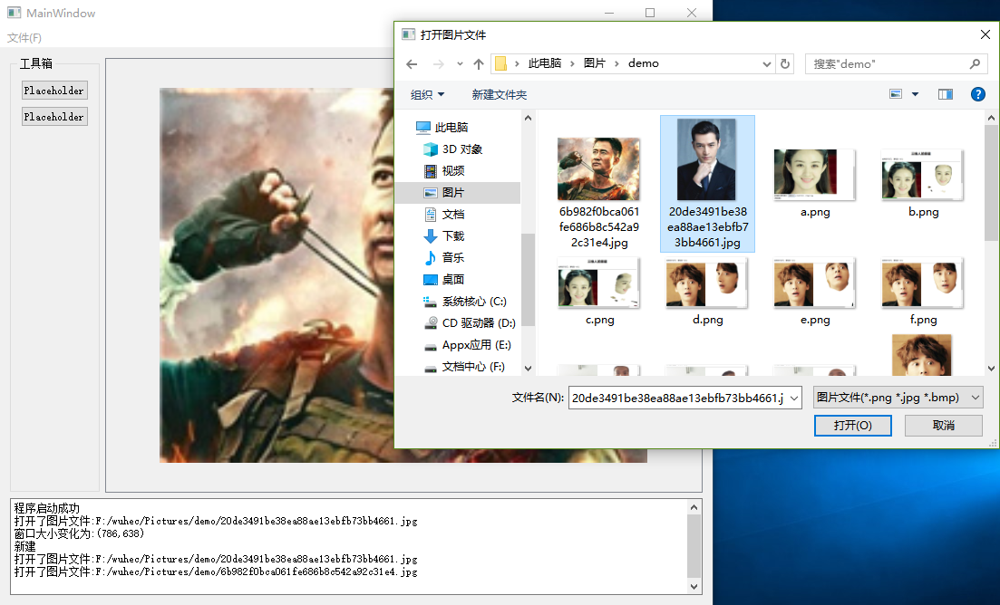

## 开发环境
开发平台：win10 x64 专业版

开发工具：Qt Creator 4.6.2

开发时间： 2018年07月10日

开发人员： 吴何聪

## （说明文档）

### 打开

使用文件对话框选取图片文件并使用OpenCV读取后显示于标签之上。

### 操作记录

于文本框中显示各个操作，如启动完成、读取图片、Size调整。

### 工具箱

未来将添加有功能的按钮

## 界面展示

## 总结
Windows下的环境配置有时还是挺恼人的。另外，Qt Widgets和Qt Quick是两个相对分离的组件框架，使用qml是在Qt Quick下，若嵌入到Qt Widgets下会有一定的通信困难，且qml组件必须依托于QQuickWidget，调整界面也有一定困难，要么就纯Widgets，要么就纯Quick。Widgets的组件自定义应使用qss或自行绘制。

