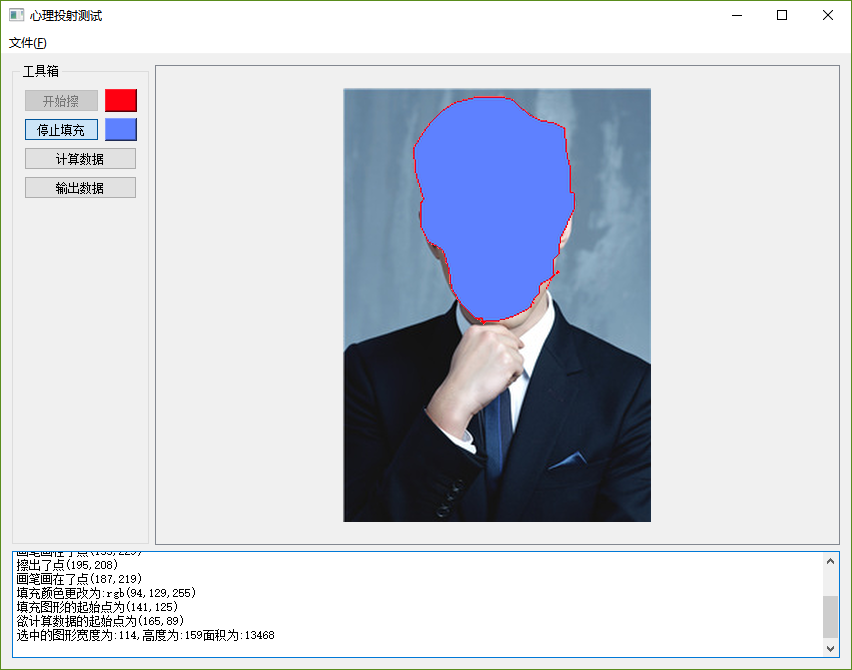
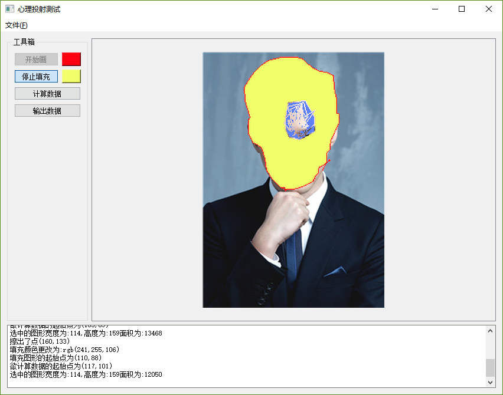

## 开发环境
开发平台：win10 x64 专业版

开发工具：Qt Creator 4.6.2

开发时间： 2018年07月31日

开发人员： 吴何聪

## （说明文档）

### 新建

新建400X400空白画布。

### 打开

使用文件对话框选取图片文件并使用OpenCV读取后显示于标签之上。

### 操作记录

于文本框中显示各个操作，如启动完成、读取图片、Size调整、画线。

### 工具箱

- 画笔按钮:
    - 画布上画点
    - 擦除点
- 填充按钮:
    - 填充封闭图形
- 计算数据按钮:
    - 计算选中区域的数据
- 输出数据按钮:
    - 将计算的数据打印在控制台

## 界面展示

## 总结
- 因为是暑假，这几天事情比较忙，所以做的晚了，总体任务难度不大，但自己的画线存在效率问题，暂时没找到优化方法。
- 我最终采用的种子填充算法，以为opencv原生实现是基于这个，后来才发现种子填充和扫描线好像都属于漫水填充。种子填充算法原理和程序都很简单, 不使用递归的话就采用了堆栈，不过用的是原生堆栈，push没有去重复。种子填充就算单纯堆栈也比较费内存和效率不高，不过在于简单所以方便计算长宽和面积，而扫描线其实是种子填充算法的改进，扫描线填充一行，减少了堆栈次数，提高了效率，但对于内部有空洞的多边形的情况，还需要多加判断，逻辑会复杂些。

